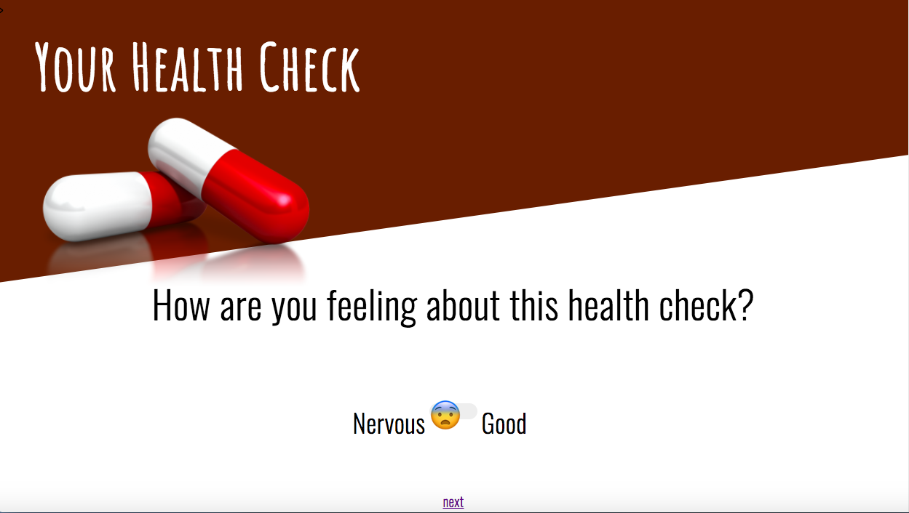

# Health-Nut

<h1>Overview</h1>

Developed in 24 hours for a health-focused Hackathon sponsored by Express Scripts. This is a Spring Boot web app with an embedded database that pulls out a summary health view of users and suggests preventive screenings and health goals based on this data, which the patient can elect whether to commit to.

The app strikes a light and playful tone while giving a set of suggestions for preventive actions

<h1>Technologies</h1>

<ul>
<li> Java </li>
<li> Spring Boot</li>
<li> SQL </li>
</ul>

